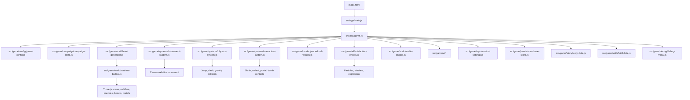

# Cubic Journey

Cubic Journey is a modular Three.js 3D platformer built around a hub world, six campaign realms, boss-gated progression, an 11-level slash minigame, remappable controls, persistent save data, and a debug cheat menu for development builds.

The repository is intentionally split into small files so future contributors can understand where each piece of logic lives and how game state moves through the app. This document explains every file in the repository except this README itself.

## Why This Stack

Cubic Journey is built with plain HTML, CSS, and JavaScript so the game stays lightweight, easy to host, and easy to load in a browser without extra framework overhead. That matters here because the project is a single-page game rather than a multi-screen web app, and the goal is to keep the runtime focused on rendering, input, and gameplay instead of framework plumbing.

Using React would add an extra layer of abstraction and bundle weight without solving a real problem for this project. The code is already organized into small modules, and the UI is mostly simple overlays and HUD panels that do not need a large component framework.

The design also aims to be approachable for people who are not especially tech-savvy or into video games. A direct browser link makes the game easy to share, easy to open on a laptop or PC, and easy to play without installing anything first.

## Requirements

- Python 3.x
- A modern browser such as Chrome, Edge, or Firefox

## Run Locally

1. Open a terminal in the project folder.
2. Start the local server:

```bash
python serve.py
```

3. Open this URL in your browser:

```text
http://127.0.0.1:8123
```

4. Stop the server with Ctrl+C.

## Architecture Summary

- `index.html` is the browser shell and the only HTML file.
- `src/app/main.js` is the application entry point.
- `src/app/game.js` is the runtime coordinator that owns the main loop and wires together every system.
- `src/game/world/level-generator.js` produces immutable level definitions.
- `src/game/world/runtime-builder.js` converts those definitions into live meshes, colliders, enemies, bombs, and atmosphere.
- `src/game/systems/*.js` contains the simulation rules for movement, physics, and interactions.
- `src/game/ui/*.js` contains all overlays and HUD components.
- `src/game/audio/audio-engine.js` plays all music and sound effects.



## Repository Map

### Root Files

- `index.html`: The page shell that mounts the game. It defines the `#ui` container, applies the basic page-level layout for the canvas, loads the live-reload script for local development, and imports `src/app/main.js` as the ES module bootstrap.
- `serve.py`: A custom static server for development. It serves files from the repository root, sets JavaScript MIME types correctly, watches the tree for changes, and pushes Server-Sent Events reload notifications so browsers refresh automatically.
- `netlify.toml`: Netlify deployment configuration. It tells Netlify to publish the repository root and ensures JavaScript files are delivered with the correct `text/javascript` content type and no-cache headers.
- `.gitignore`: Excludes operating-system junk, editor folders, and log files. This keeps local artifacts such as smoke test logs and IDE settings out of version control.
- `favicon.ico`: Browser tab icon used by the game page.
- `smoke_stdout.log`: Captured stdout from local smoke tests. This is a generated diagnostic artifact and is not used by the game at runtime.
- `smoke_stderr.log`: Captured stderr from local smoke tests. Like the stdout log, this is only useful for local debugging.
- `.github/workflows/`: Empty placeholder folder for future CI workflows. There are no workflow YAML files checked in yet.

### `src/app`

- `src/app/main.js`: Bootstraps the application UI. It locates the `#ui` mount point, constructs the title screen, and routes the player either into campaign mode or into the slash minigame depending on which button is chosen.
- `src/app/game.js`: The main orchestration layer. It creates the renderer, scene, camera controller, input layer, HUD, pause menu, controls editor, shop, campaign info modal, loading screen, audio engine, campaign state, action-effects manager, and procedural visuals. It also owns the game loop, world transitions, minigame rules, combat resolution, damage response, save writes, and the data model passed into the HUD and menus.

### `src/engine`

- `src/engine/three.js`: Central Three.js re-export. Keeping the import in one place makes it easy to swap the underlying source later without touching every gameplay file.
- `src/engine/core/render-context.js`: Builds the rendering context. It creates the scene, camera, renderer, shadow settings, tone mapping, fog, and base lighting, then attaches resize handling so the canvas stays sized to the viewport.
- `src/engine/camera/camera-controller.js`: Implements the orbit camera. Mouse dragging rotates the camera, arrow keys nudge yaw and pitch, `getMoveBasis()` exposes camera-relative movement vectors, and `shake()` adds short-lived positional jitter for impact feedback.
- `src/engine/input/input.js`: Keyboard and mouse input abstraction. It tracks raw key state, edge-triggered action presses, and mouse drag state, then exposes a binding-driven action API so gameplay code does not need to know individual key codes.

### `src/game/config`

- `src/game/config/game-config.js`: Primary gameplay tuning file. It defines the player movement constants, campaign world order, stage counts, portal gating rules, hub sky color, and whether each world has a sun object. If the campaign structure changes, this file needs to stay in sync with campaign progression and the level generator.

### `src/game/campaign`

- `src/game/campaign/campaign-state.js`: Campaign progression state machine. It creates the default save data, tracks current mode, current world and stage, counts completed stages, handles boss clears and key cube awards, enforces final-world access rules, and exposes serialization helpers for persistence.

### `src/game/world`

- `src/game/world/level-generator.js`: Deterministic level definition generator. It uses seeded random numbers to create the hub layout, regular campaign stages, boss stages, and all 11 slash-minigame levels. It decides where platforms, collectibles, jump pads, dash orbs, enemies, and bombs appear, and it marks which levels count as boss stages.
- `src/game/world/runtime-builder.js`: Runtime scene builder and per-frame updater. It turns a generated level definition into actual Three.js meshes and runtime objects, builds colliders, creates moving platforms, adds scenery and atmosphere, spawns enemies and bombs, and updates them every frame with movement, pulsing, chase logic, and respawn timing.

### `src/game/systems`

- `src/game/systems/movement-system.js`: Converts input into horizontal velocity. It reads the camera basis, resolves forward/back/left/right actions, and writes the resulting movement vector into the player velocity.
- `src/game/systems/physics-system.js`: Applies jump, dash, gravity, and collision rules. It resolves grounded landing, wall contact, wall jump behavior, extra air jumps, glide, platform magnet snapping, and fall resets.
- `src/game/systems/interaction-system.js`: Handles non-physics gameplay interactions. It resolves collectible pickup, jump pad activation, dash orb pickup, portal proximity checks, goal reach checks, enemy stomp and contact damage, sword slash hit detection, and bomb touch/explosion resolution.

### `src/game/render`

- `src/game/render/procedural-visuals.js`: Procedural art and character builder. It generates all canvas textures used by the game world, then constructs the player avatar and goblin enemy meshes from lit Three.js primitives with materials that use those textures.

### `src/game/effects`

- `src/game/effects/action-effects.js`: Combat and action feedback system. It maintains particle pools, slash meshes, sphere slash meshes, and explosion visuals, and it exposes emit helpers that gameplay code calls when the player jumps, dashes, slashes, gets hit, lands, or triggers a blast.

### `src/game/audio`

- `src/game/audio/audio-engine.js`: Audio playback manager. It unlocks audio after user interaction, manages looping background music, switches tracks by game state, and keeps pooled sound effect channels so repeated sounds can overlap cleanly.

#### `src/game/audio/music`

- `src/game/audio/music/title.mp3`: The title-screen track. It is used before gameplay begins.
- `src/game/audio/music/hub.mp3`: The hub-world background track. It plays when the player is in the central hub.
- `src/game/audio/music/meadow.mp3`: The Meadow Rise stage track.
- `src/game/audio/music/canyon.mp3`: The Canyon Forge stage track.
- `src/game/audio/music/nebula.mp3`: The Nebula Heights stage track.
- `src/game/audio/music/obsidian.mp3`: The Obsidian Crown stage track.
- `src/game/audio/music/aurora.mp3`: The Aurora Vault stage track.
- `src/game/audio/music/core.mp3`: The Core Rift stage track.
- `src/game/audio/music/boss.mp3`: The boss-encounter track used when the game enters a boss state.

#### `src/game/audio/sfx`

- `src/game/audio/sfx/jump.mp3`: Played for jumps and jump-related movement feedback.
- `src/game/audio/sfx/dash.mp3`: Played when the player dashes.
- `src/game/audio/sfx/collect.mp3`: Played when collectibles are gathered.
- `src/game/audio/sfx/portal.mp3`: Played when entering or using portals.
- `src/game/audio/sfx/key.mp3`: Played when a key cube is awarded.
- `src/game/audio/sfx/boss.mp3`: Boss-specific sound cue used by boss progression and encounter moments.
- `src/game/audio/sfx/enemy.mp3`: Generic enemy hit and slash-impact sound.
- `src/game/audio/sfx/enemy-defeat.mp3`: Shared defeat/explosion sound used for enemy defeat and explosive feedback.
- `src/game/audio/sfx/damage.mp3`: Player damage feedback sound.
- `src/game/audio/sfx/pause.mp3`: Pause and unpause sound.
- `src/game/audio/sfx/credits.mp3`: End-screen and credits sound.

### `src/game/input`

- `src/game/input/control-settings.js`: Persistent control binding store. It defines the shipped keyboard layout, loads overrides from localStorage, saves rebinding changes, resets defaults, and clears stored bindings when requested.

### `src/game/persistence`

- `src/game/persistence/save-store.js`: Save-game persistence layer. It reads and writes the campaign save object in localStorage and merges loaded data back into the current default structure so missing fields do not break older saves.

### `src/game/skills`

- `src/game/skills/skill-data.js`: Skill catalog and default ownership state. It defines the upgrade list used by the shop and the initial unlocked/locked state for each skill.

### `src/game/story`

- `src/game/story/story-data.js`: Story text data. It stores the campaign premise, one-liner world narratives, and boss names used by the campaign info menu and pause menu.

### `src/game/debug`

- `src/game/debug/debug-menu.js`: Developer-only cheat and test interface. It exposes world travel, skill toggles, save editing, progress shortcuts, and end-credit triggers so the branch can be tested without normal progression flow.

### `src/game/ui`

- `src/game/ui/ui-theme.js`: Shared UI theme and component styling helpers. It injects the project-wide CSS, defines the glass-panel look, button variants, chips, scrollbars, overlays, cards, headings, and text styles, and keeps all menus visually consistent.
- `src/game/ui/title-screen.js`: Title screen overlay and start gate. It renders the opening panel, animates the background, opens the campaign or minigame, and includes the source-code link.
- `src/game/ui/hud.js`: In-game HUD builder. It shows world, stage, currency, key-cube, boss, objective, portal prompt, skip prompt, and charge-ready state, and it also provides the campaign info toggle and HUD collapse toggle.
- `src/game/ui/pause-menu.js`: Pause overlay and world navigation screen. It presents resume, music, controls, shop, campaign info, title return, hub return, and save reset actions, plus the world list and campaign statistics.
- `src/game/ui/controls-menu.js`: Input rebinding interface. It lists every bound action, captures the next pressed key when rebinding, allows clearing bindings, and can restore the defaults.
- `src/game/ui/world-menu.js`: Fast travel and world overview menu. It summarizes each world, shows whether it is accessible, allows travel to the hub or a specific world stage, and exposes a compact player guide.
- `src/game/ui/shop-menu.js`: Skill shop overlay. It displays every unlockable movement skill, shows current ownership and coin cost, and calls back into campaign state when the player buys a skill.
- `src/game/ui/loading-screen.js`: Loading overlay used during world transitions. It shows a loading message, animated progress bar, and a disabled status button while the game is constructing a new runtime.
- `src/game/ui/campaign-info-menu.js`: Campaign summary modal. It shows the current world, story text, progress counters, key cubes, currency, skill count, and boss name so players can check campaign status without leaving the game.

## Generated or Local-Only Files

- `smoke_stdout.log` and `smoke_stderr.log` are local diagnostics from previous smoke checks. They are useful when debugging the development environment, but they are not part of the playable game.
- The empty `.github/workflows/` folder is a placeholder for future CI configuration if you want to add automated checks later.

## How the Runtime Fits Together

1. The browser opens `index.html`, which loads `src/app/main.js`.
2. `main.js` creates the title screen and waits for the player to choose campaign or minigame.
3. `game.js` builds the runtime, menus, visuals, audio, and state containers.
4. The campaign state decides whether the player is in the hub or a specific world and stage.
5. `level-generator.js` produces a deterministic definition for that location.
6. `runtime-builder.js` converts the definition into live meshes and runtime objects.
7. The movement, physics, and interaction systems run every frame to update the player and world.
8. The HUD and overlay menus read the current model data and keep the UI in sync with gameplay.

## Making Your Own Game

Cubic Journey is designed to be forked and customized. The modular architecture makes it easy to modify game content, mechanics, and story while keeping the runtime stable.

### Getting Started with a Fork

1. Download or clone this repository.
2. Copy the entire project folder and rename it to your game's name.
3. Follow the "Run Locally" section above to start developing.

### What You Can Change

The repository map above shows every file and what it does. Here are the most common starting points:

- **Story & Progression**: Edit `src/game/config/game-config.js` to define your worlds, stages, and boss encounters. Update `src/game/story/story-data.js` with your narrative.
- **World Layout & Visuals**: Modify `src/game/world/level-generator.js` to change terrain, platforms, and atmosphere. Adjust colors and materials in `src/game/world/runtime-builder.js`.
- **Gameplay Mechanics**: Edit the systems in `src/game/systems/` to change movement speed, physics, or combat rules. Tune constants in `src/app/game.js` to adjust game feel.
- **UI & Overlays**: Customize menus and HUD in `src/game/ui/` to match your game's style and story.
- **Audio & Effects**: Replace or add sounds in `src/game/audio/music/` and `src/game/audio/sfx/`, then register them in `src/game/audio/audio-engine.js`.
- **Player Skills & Items**: Expand `src/game/skills/` or add new item types in the persistence and campaign state modules.

### Deployment

Once your game is ready:

1. Replace the placeholder assets (music, sound effects, textures) with your own.
2. Update `index.html` to set your game's title and meta tags.
3. Deploy the entire folder to any static host (Netlify, Vercel, GitHub Pages, etc.). The project is static HTML/CSS/JS with no build step required.
4. Update this README with your game's description, story, and credits.

### Architecture Notes

The codebase is intentionally split into small files so each piece is easy to find and modify without affecting others. The general flow is:

- Data first: Define your game in `game-config.js` and `story-data.js`.
- Runtime second: Let `level-generator.js` and `runtime-builder.js` turn those definitions into live scenes.
- Gameplay last: Wire the systems and UI to react to player input and world state.

Keep these files in sync when making large changes: `game-config.js`, `campaign-state.js`, `level-generator.js`, and `runtime-builder.js`. They all work together to define progression and content.

### Questions?

Refer to the repository map above to understand what each file does, then modify it to match your vision. The game is yours to make—customize, extend, and share!

## Glossary

- Campaign state: The save-backed progress model that remembers worlds, stages, key cubes, currency, and skills.
- Runtime: The live Three.js scene for the currently loaded hub, stage, or minigame.
- Level definition: The plain data produced by `level-generator.js` before anything is turned into meshes.
- Collider: The axis-aligned box used by the physics system for platform and wall contact.
- Action effects: Temporary combat VFX such as slash arcs, particles, and explosions.
- HUD: The on-screen status interface for world, stage, objective, and prompt information.


